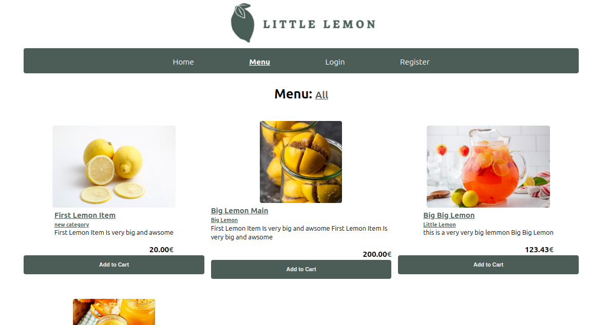

# The repository for the Backend and Frontend of The Little Lemon Website

## Introduction

Little Lemon is a fictional restaurant company for the Meta Backend developer course. 

This application is divided into two parts: Client and Server

The Server is built with Django, Django REST FRAMEWORK, and MySQL.

The Client is built with Reactjs. It is <strong>divided into two parts: Customers and staff Members, staff is also divided into Managers and delivery crew.</strong>

### The Main Functionality of the application:

<strong> The Manager can </strong>: log in and get a <strong> manager token</strong>, assign users to the manager group, assign users to the delivery crew, add, update, delete menu items, add, update, delete categories, 

The delivery crew can access orders assigned to them, update an order as delivered
Customers can register, log in using their username and password, get access tokens, browse all categories, and menu items, view menu items by category, add menu items to the cart, place orders, and view previously made orders.

The Client allows customers, managers, and delivery crew to do the previously described operations.

### Client is built with React js

### Server is built with Python Django

#### View the README.md in each folder for more information and how to get started with the application.

## DEMO Video

